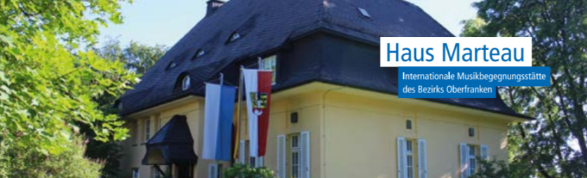

 

###### __課程說明 :__   
註冊方式: 您可以點選"報名連結"下載報名表或在www.haus-marteau.de上使用線上註冊。 
 
課程內容:
協助學生準備比賽，入學考試等。以舉世聞名的Neuhaus School的傳統，結合了俄羅斯和歐洲的教學方法進行教學。 
自由選曲: 浪漫樂派 (如: Brahms、Chopin、Liszt、Rachmaninov、Schumann)，印象樂派 (如: Debussy、Ravel)等，亦或是室內樂曲目(如: 聲樂伴奏、器樂伴奏)

報名須知:
- 課程人數為8-10人，逾期或人數額滿皆不受辦理
- 請在報名資料裡提供您的簡介(特別是有關您的音樂生涯) 
- 請在課程開始前將課程款項匯入，並註明姓名以及課程編號 
- 如果因故不克前往大師班，最慢必須在課程開始前14天取消，主辦單位將退還課程費用，但會額外收取15歐元手續費。逾期取消課程則不退還全額費用。 
- 課程費用250歐元並不包括住宿和伙食費 
- 免責聲明: 主辦方Bezirk Oberfranken對於因為參加Haus Marteau大師班或音樂會期間受到人身傷害，財務損失以及樂器損傷不承擔任何責任。

 
聯絡方式:  
Bezirk Oberfranken Kultur- und Heimatpflege  
Ludwigstr. 20, D-95444 Bayreuth 
Fax: +49(0)921 6041606 
email: kultur@bezirk-oberfranken.de
 
 

 

更多詳細資料請點選"官方網站"連結 😊
