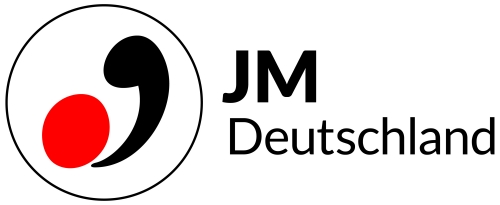

 
 
###### __關於主辦單位 Jeunesses Musicales Deutschland 簡介 :__  

Die Jeunesses Musicales Deutschland (JMD) 是 國際青年音樂協會JMI（Jeunesses Musicales International）位於德國的分部。
JMI機構於1945年在布魯塞爾成立，是世界上最大的青年音樂非政府組織，目前活躍於全球50多個國家。目標是促進年輕音樂家交流，使他們通過音樂超越國界的發展。 
該組織在德國音樂圈扮演著非常重要的角色，除了舉辦各大音樂比賽，提供演出平台，協助籌辦音樂會以外，目前合作的德國青少年樂團從音樂學校樂團至各省邦的青少年管弦樂團約有300個。
由基金會所承辦的Musikakademie Schloss Weikersheim (Weikersheim城堡音樂學院)，定期開設音樂課程，來自世界各地的年輕音樂家們藉著不同的活動一起在此分享以及學習音樂，
課程從兒童大提琴訓練營到大師班，樂團面試以及演奏訓練等，內容相當廣泛。
 
 
 

###### __JM Deutschland Meisterkurs 課程說明 :__   
 
 報名對象: 音樂系學生或有演奏基礎的學生 
 每位學員在課程期間有3節個別課，被授課曲目可自選獨奏作品，樂團片段或音樂會曲目。 
 
 授課語言: 英文,德文。 
 
 
 上課地點: Leopold-Mozart-Zentrum der Universität Augsburg (奧格斯堡音樂學院)
       Maximilianstr. 59, 86150 Augsburg 
 
 
 活動期間授課老師: 
 Prof. Heike Steinbrecher (Leopold-Mozart-Zentrum Universität Augsburg) - Oboe, Englischhorn 
 Prof. Harald Harrer (LMZ Universität Augsburg) - Klarinette 
 Prof. Karsten Nagel (LMZ Universität Augsburg) - Fagott    
 
聯絡方式:
Ruth Harrer-Braun 
Franz-Marc-Str. 3 
86157 Augsburg 
Tel.: 0821 742913, Mobil 0177 3314916 
Fax: 0821 742914 
harrer.braun@t-online.de 

 

更多詳細資料請點選"官方網站"連結 😊
